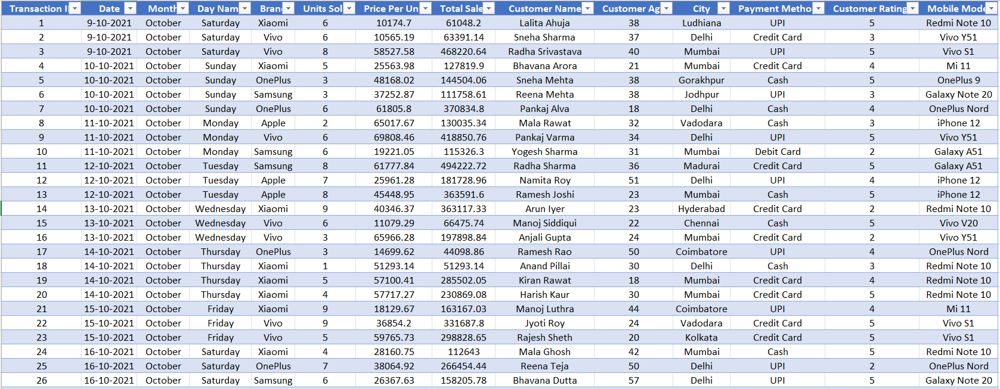
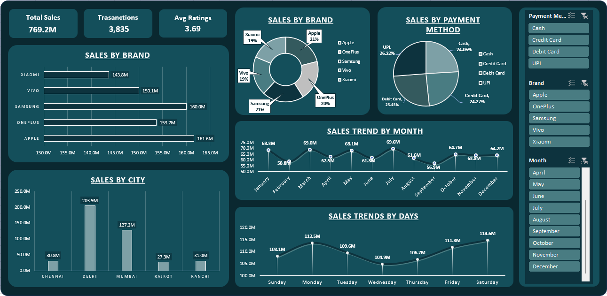

# Smartphone Sales Analysis Dashboard (Excel)

## Project Overview

This project analyzes smartphone sales data using Microsoft Excel to identify key business insights. The dataset contains transaction-level sales information including brand, city, payment method, customer demographics, and product details.

The objective of this project is to transform raw sales data into meaningful insights through data cleaning, pivot table analysis, and an interactive Excel dashboard that helps understand sales performance and customer purchasing behavior.

---

## Business Objective

The goal of this analysis is to evaluate smartphone sales performance across different brands, cities, and payment methods to understand revenue drivers and customer purchasing behavior.

---

## Dataset Preview

Note: The dataset used in this project is a sample dataset created for analytical practice and dashboard development.

---

## Dataset Information

The dataset contains smartphone sales transactions with the following fields:

Transaction ID – Unique identifier for each transaction  
Date – Date of purchase  
Month – Month of transaction  
Day Name – Day of the week  
Brand – Smartphone brand sold  
Units Sold – Number of units sold  
Price Per Unit – Price of each smartphone  
Total Sales – Total value of the transaction  
Customer Name – Customer making the purchase  
Customer Age – Age of the customer  
City – City where the sale occurred  
Payment Method – Mode of payment used  
Customer Rating – Rating provided by the customer  
Mobile Model – Smartphone model purchased

---

## Business Problems

This analysis answers the following business questions:

- Which smartphone brand generates the highest sales revenue?  
- Which cities contribute the most to total smartphone sales?  
- What payment methods do customers prefer the most?  
- How do smartphone sales vary across different months?  
- Which days of the week generate the highest sales?   
- What is the average customer rating for purchases?

---

## KPIs

The dashboard highlights the following key performance indicators:

Total Sales: 769.2M  

Total Transactions: 3,835  

Average Customer Rating: 3.69

---

## Dashboard Visualizations

The interactive Excel dashboard presents key sales insights using the following visualizations:

- **Sales by Brand** – Compares total sales generated by different smartphone brands.  
- **Sales by Payment Method** – Shows the distribution of transactions across payment modes such as UPI, Cash, Credit Card, and Debit Card.  
- **Sales by City** – Highlights geographic performance by comparing sales across major cities.  
- **Sales Trend by Months** – Displays how sales fluctuate throughout the year.  
- **Sales Trend by Days** – Shows sales performance across different days of the week.  
- **Interactive Filters (Slicers)** – Allows dynamic filtering by **Brand, Payment Method, and Month** for deeper analysis.

---

## Dashboard Features

The Excel dashboard is interactive and allows users to explore smartphone sales data dynamically using Excel Slicers.

Key features include:

- **Brand Slicer** – Allows users to analyze sales performance for specific smartphone brands.

- **Payment Method Slicer** – Enables comparison of sales based on customer payment preferences.

- **Month Slicer** – Helps track how smartphone sales change across different months.

- **Dynamic KPIs** – Metrics such as Total Sales, Total Transactions, and Average Rating automatically update when slicers are applied.

- **Interactive Pivot Charts** – All charts update instantly based on slicer selections, allowing flexible analysis of the data.

These features allow users to perform flexible sales analysis without modifying the underlying dataset.

---

## Tools Used

Microsoft Excel

Excel features used in this project:

- Data Cleaning  
- Pivot Tables  
- Pivot Charts  
- Slicers  
- Dashboard Design

---

## Key Insights and Business Recommendations

- **Apple generated the highest total smartphone sales among all brands, indicating strong market demand and brand preference.**

Recommendation:  
The business should maintain strong inventory levels for Apple devices and consider running targeted promotions or bundle offers to capitalize on the high demand.

- **Delhi recorded the highest smartphone sales compared to other cities, suggesting a strong customer base in this market.**

Recommendation:  
The company can focus more marketing campaigns, retail partnerships, and promotional activities in Delhi to further increase market share.

- **UPI and Debit Card are among the most frequently used payment methods by customers.**

Recommendation:  
Businesses should ensure smooth digital payment processing and consider offering cashback or loyalty incentives to encourage these payment methods.

- **Sales fluctuate across different months, indicating possible seasonal demand patterns in smartphone purchases.**

Recommendation:  
The company should align marketing campaigns, product launches, and discount strategies with high-demand months to maximize revenue.

- **Mondays and Saturdays record higher sales compared to Sundays and mid-week days.**

Recommendation:  
Promotional campaigns and limited-time offers can be scheduled on high-traffic days like Mondays and Saturdays to drive even higher sales volume.

- **The average customer rating is approximately 3.69, indicating moderate customer satisfaction.**

Recommendation:  
The business should analyze customer feedback and focus on improving product quality, after-sales service, and overall customer experience to increase satisfaction ratings.

---

## Skills Demonstrated

- Data Cleaning and Preparation  
- Data Analysis using Pivot Tables  
- Data Visualization  
- Dashboard Development  
- Business Insight Generation

---

## Files Included

dataset_preview.png – Screenshot of dataset used in the analysis

smartphone_sales_analysis_excel.xlsx – Excel analysis and dashboard 

smartphone_sales_dashboard.png – Screenshot of the final Excel dashboard

---

## Project Structure

The Excel workbook contains the following sheets:

Data – Original dataset used for analysis  
Pivot_Analysis – Pivot tables and Pivot Charts for intermediate analysis  
Dashboard – Final interactive Excel dashboard

---

## How to Use

1. Download the Excel file from this repository.
2. Open the file using Microsoft Excel.
3. Navigate to the **Dashboard** sheet.
4. Use the slicers to filter data by Brand, Payment Method, or Month.
5. Explore the visualizations to analyze smartphone sales performance.

---

## Repository Structure

Smartphone-Sales-Analysis-Excel
│
├── README.md
├── dataset_preview.png
├── smartphone_sales_analysis_excel.xlsx
└── smartphone_sales_dashboard.png

---

## Author

Sarvesh Vernekar  
Aspiring Business / Data Analyst
